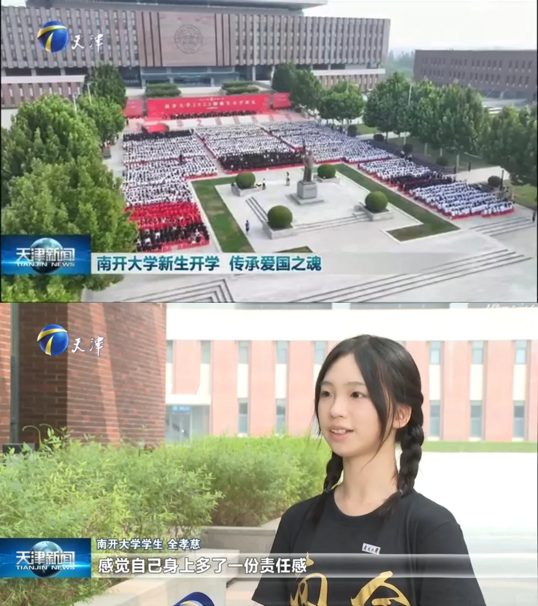
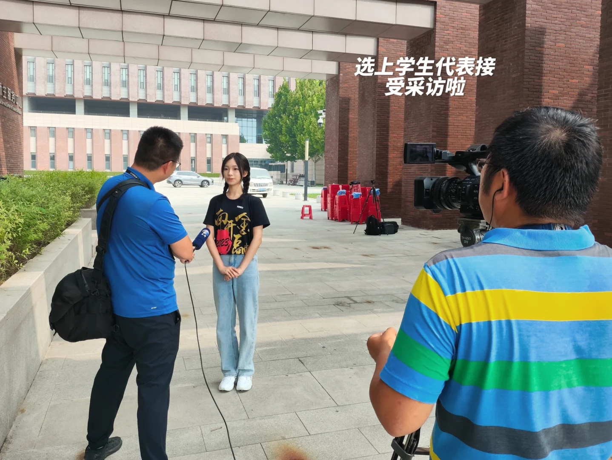

# 妈妈我上电视啦｜南开大一新生代表采访

## 基本信息

- 作者：星月祺迹
- 发布时间：2023-09-13 11:06:24
- 点赞数：5113
- 收藏数：364
- 评论数：244
- 分享数：72

## 正文

选上采访学生代表啦，前一晚准备了一下还是有点紧张，但真的很荣幸！
#天津[话题]# #南开大学[话题]# ##南开大学津南校区[话题]#

## 图片

## 评论

### suyisu (1970-01-01 08:00:00)

“乖巧”的具象化[doge]

### 冬落迟 (1970-01-01 08:00:00)

新生代表是怎么选出来的呀？每次开学典礼都会有这个疑惑[偷笑R]

### lridescent (1970-01-01 08:00:00)

自信的人永远最美[点赞R][点赞R]，未来可期呀，学妹。

### Yqyq (1970-01-01 08:00:00)

金院的衣服真气派

### 碎遮 (1970-01-01 08:00:00)

兄弟们，这女孩儿我是真心喜欢

### 艾欧里亚 (1970-01-01 08:00:00)

全这个姓，朝鲜族？

### 霸道财神爱上我 (1970-01-01 08:00:00)

名字好好听啊

### Niiz (1970-01-01 08:00:00)

six，嘉乐学子，必须让嘉乐请你回去演讲🎤[doge][doge]

### 非一非异 (1970-01-01 08:00:00)

名字讲究啊，又孝，又有爱心（“慈”），还都全！

### ᝰꫛꪮꪮꫜ 🌙 (1970-01-01 08:00:00)

好漂亮[哭惹R]我要报考南开大学[哭惹R]

