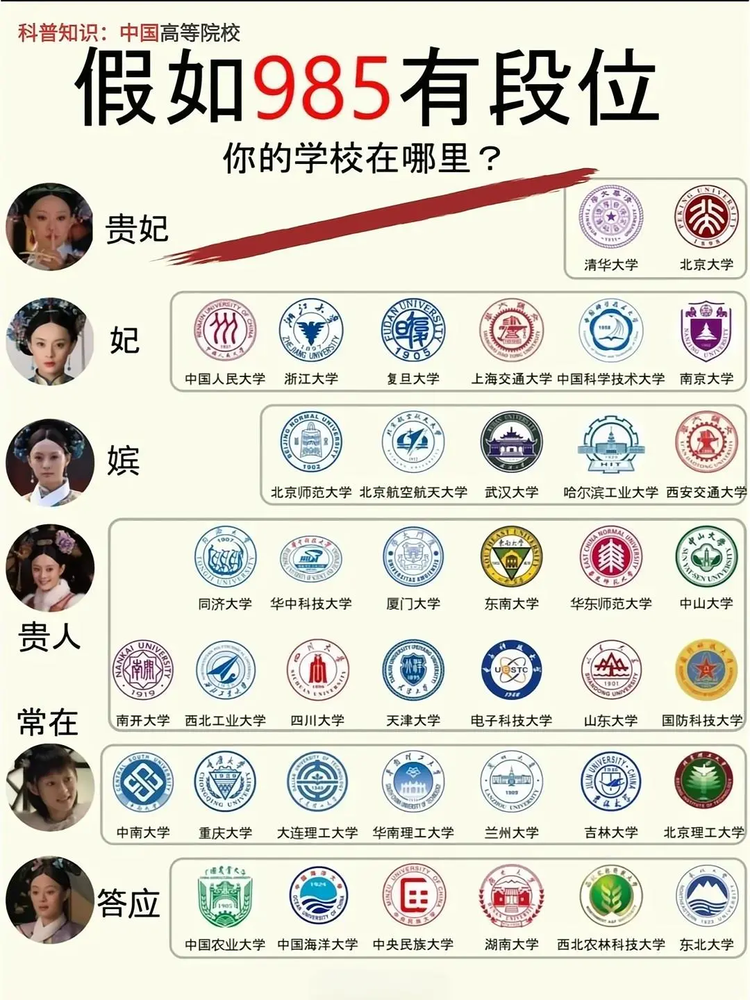
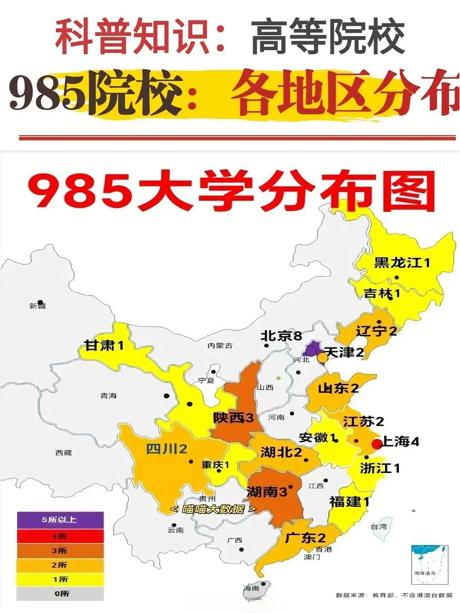
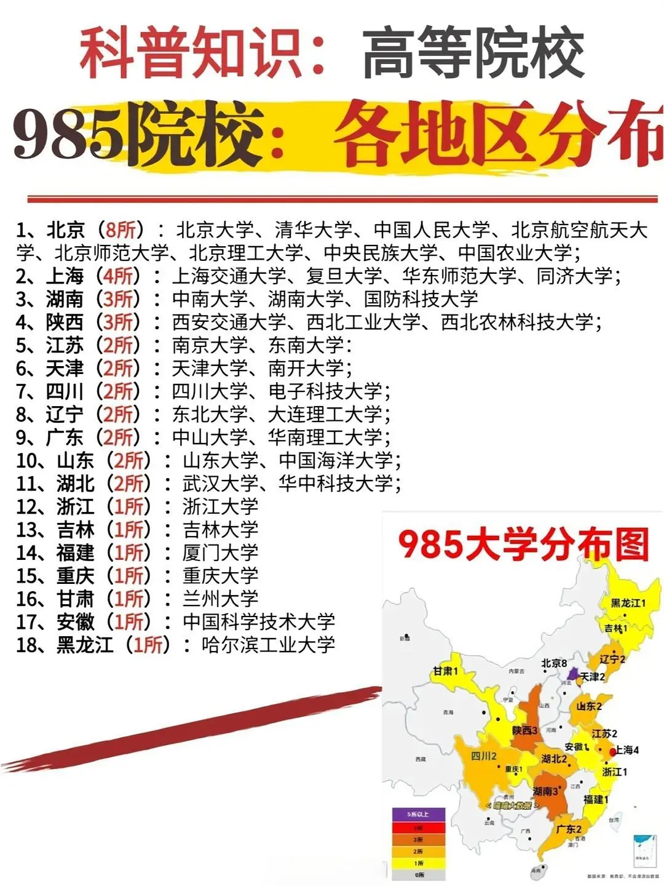

# 高考学子，快来看看你们的大学

## 基本信息

- 作者：花sir
- 发布时间：2024-06-13 09:31:00
- 点赞数：8221
- 收藏数：2974
- 评论数：291
- 分享数：538

## 正文

宝子们，众所周知，985 大学那可是我国最为优秀的大学呀！
那在高考前要不要知道 985 大学具体指哪些大学呢？当然要啦！为了能更好地了解它们，下面就跟着我一起来看看这些大学分别是哪些，顺便了解一下它们都坐落于全国的哪些地方吧！
🎯985 大学是什么意思：985 又称 985 工程大学，是 1998 年五月份在北京大学校庆时提出要建设一批具有国际水准的高水平研究型的大学及国际一流大学。因为是在 1998 年五月份提出的，所以这些大学就简称 985 啦。目前国内一共有 39 所哦！
来看看 985 大学汇总：
🔺北京（8 所 985 大学）：北京大学、清华大学、中国人民大学、北京航空航天大学、北京师范大学、北京理工大学、中央民族大学、中国农业大学；
🔺上海（4 所 985 大学）：上海交通大学、复旦大学、华东师范大学、同济大学；
🔺湖南（3 所 985 大学）：中南大学、湖南大学、国防科技大学；
🔺陕西（3 所 985 大学）：西安交通大学、西北工业大学、西北农林科技大学；
🔺江苏（2 所 985 大学）：南京大学、东南大学；
🔺天津（2 所 985 大学）：天津大学、南开大学；
🔺四川（2 所 985 大学）：四川大学、电子科技大学；
🔺辽宁（2 所 985 大学）：东北大学、大连理工大学；
🔺广东（2 所 985 大学）：中山大学、华南理工大学；
🔺山东（2 所 985 大学）：山东大学、中国海洋大学；
🔺湖北（2 所 985 大学）：武汉大学、华中科技大学；
🔺浙江（1 所 985 大学）：浙江大学；
🔺吉林（1 所 985 大学）：吉林大学；
🔺福建（1 所 985 大学）：厦门大学；
🔺重庆（1 所 985 大学）：重庆大学；
🔺甘肃（1 所 985 大学）：兰州大学；
🔺安徽（1 所 985 大学）：中国科学技术大学；
🔺黑龙江（1 所 985 大学）：哈尔滨工业大学。 #高考[话题]#  #高考志愿填报[话题]#  #985[话题]#  #985大学[话题]#   #2024高考季[话题]#  #高考生[话题]#

## 图片

## 评论

### 狗子一只 (1970-01-01 08:00:00)

211是通房丫头吗

### 又下雨了 (1970-01-01 08:00:00)

北京理工大学的排序低了

### 胡罗啵啵 (1970-01-01 08:00:00)

想知道厦大和川大哪个好

### Yoroll (1970-01-01 08:00:00)

北师大和华东师范大学选哪个[笑哭R]

### Msavieey. (1970-01-01 08:00:00)

中山大学和重庆大学哪个好一点（理科生）

### 夜猫儿爱吃鱼 (1970-01-01 08:00:00)

华科比武大好，你这信息落后了

### 鑫 (1970-01-01 08:00:00)

想知道厦大和西安交通大学哪个好啊？

### 小红薯6306C1C5 (1970-01-01 08:00:00)

逆天排行

### 咿咿呀呀呀 (1970-01-01 08:00:00)

@懒得取名. 答应等级那里

### 雪碧ding (1970-01-01 08:00:00)

我上学时候，吉大还是前十，十几年过去了，我没努力，它可见也没努力，名次都跌出去这么多，那我今年回校也不觉得丢人了

