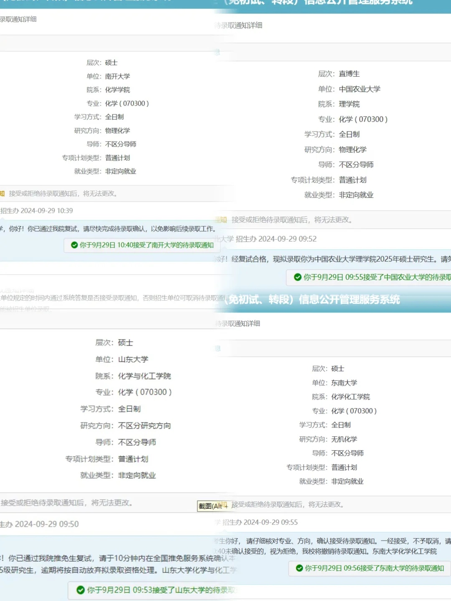

# 全员上岸~四小只双非保研985

## 基本信息

- 作者：0711
- 发布时间：2024-09-30 19:46:54
- 点赞数：2452
- 收藏数：183
- 评论数：411
- 分享数：144

## 正文

一起保研上岸!遇强则强的友情令人心动拥有一群优秀的朋友们是什么体验[赞R]
sxnu一起上岸→南开大学，山东大学，东南大学，中国农业大学[派对R]
#相互成就[话题]# #大学生[话题]##保研[话题]##保研分享[话题]##朋友[话题]# #保研经验分享[话题]# #南开大学[话题]##山东大学[话题]##东南大学[话题]##中国农业大学[话题]#

## 图片

## 评论

### momo (1970-01-01 08:00:00)

人家保研说明这几位同学本科成绩都是前几名 非常优秀的 为什么都在歧视本科学历而否定别人的努力啊 在一所学校做到顶尖然后去更好的地方犯法嘛[笑哭R]

### 鸳梦重温1312 (1970-01-01 08:00:00)

这几个学生排名应该在前3%，结合学校的保研率推测。

### 星悦欤 (1970-01-01 08:00:00)

二本院校都可以保研了，资源越来越好了啊

### 暴打momo (1970-01-01 08:00:00)

山西师范大学都能保研？

### STOIGANT (1970-01-01 08:00:00)

虽然话不好听，但是建议毕业还是去当二三本的老师吧。这行业别说女生了，男生都不好找，学历多高都没用。而且双非本就是案底（因为我也是），更何况你的学校确实很一般（软科251）[捂脸R]

### 不许欺负大棕熊 (1970-01-01 08:00:00)

你们这个是大三结束就有通知还是大四上啊

### Kassy' (1970-01-01 08:00:00)

这个专业出来就是失业啊[失望R]保研好保的一般都是有坑的

### 小红薯 (1970-01-01 08:00:00)

nku夏令营把我拒了[微笑R]

### 霁月的狗 (1970-01-01 08:00:00)

那也太牛了吧，和我们寝室有的一拼了

### 七远 (1970-01-01 08:00:00)

恭喜博主上岸 也愿你在未来的日子里，步步生莲，笑看风云！美好如约而至！[太阳R]

