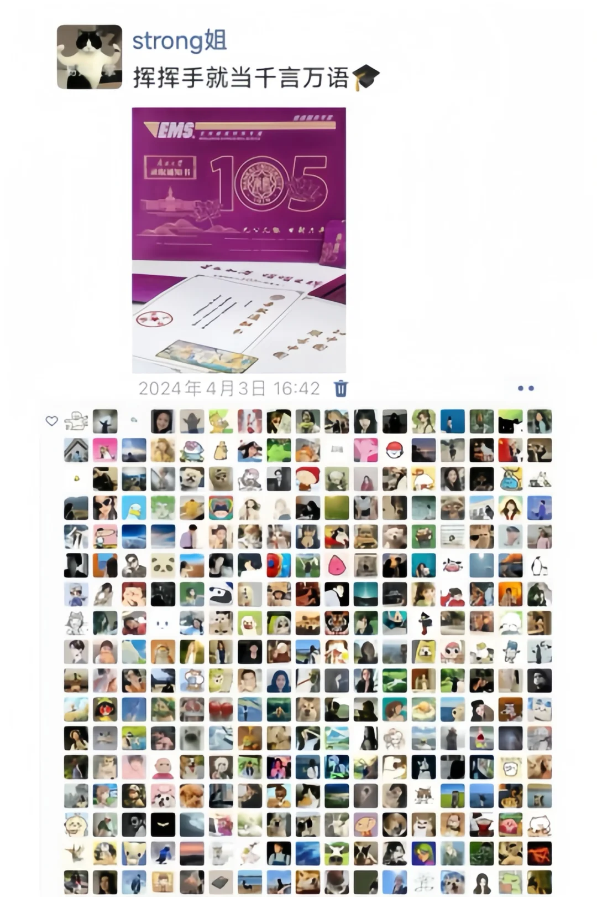
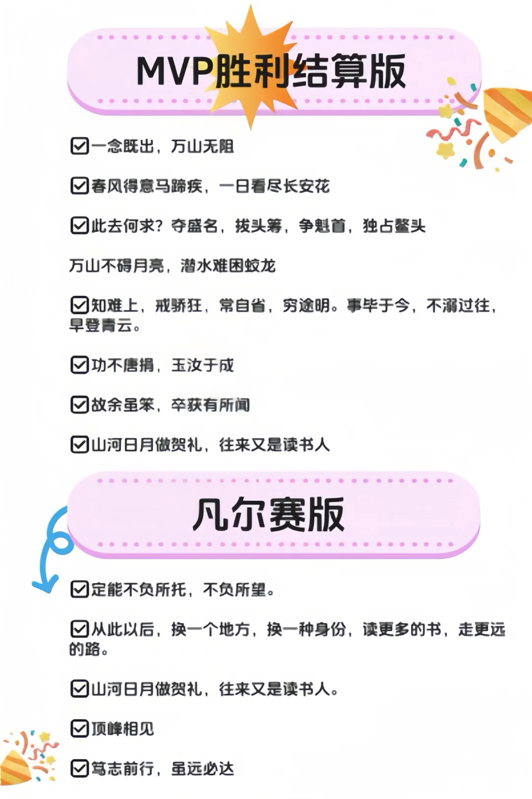
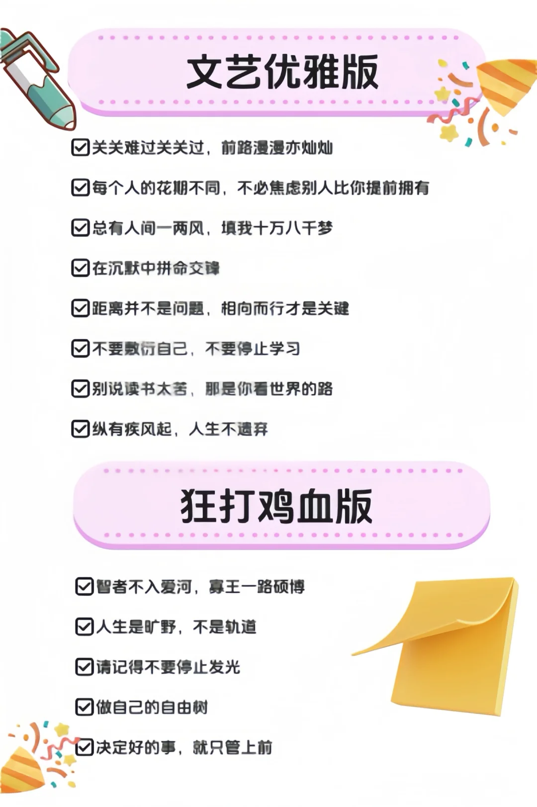

# strong姐当年准备的南开考研上岸文案

## 基本信息

- 作者：南开大学考研加油站💜
- 发布时间：2024-11-18 11:43:04
- 点赞数：4782
- 收藏数：1938
- 评论数：469
- 分享数：150

## 正文

玄得很！！！刷到就是要用到！！！
[派对R][派对R]学姐祝所有考研人一切顺利！！！
	
#考研上岸经验[话题]# #朋友圈分享[话题]# #南开大学[话题]#  #南开大学考研[话题]# #25考研[话题]# #26考研[话题]# #考研[话题]# #考研择校[话题]# #上岸[话题]# #上岸朋友圈文案[话题]#

## 图片

## 评论

### 无所谓偏爱 (1970-01-01 08:00:00)

我要发 炒菜不用放盐了 因为你的研来了[生气R]

### cc（一定上岸！） (1970-01-01 08:00:00)

我要发 花了一年研究死 现在总算研究生了[生气R][生气R]

### Judy_yeah！ (1970-01-01 08:00:00)

“至此，原谅了我的18岁[可怜R][可怜R]

### 展展 (1970-01-01 08:00:00)

评论区的我全偷了，不好意思我考上我要发一百条

### Ｏ椰 (1970-01-01 08:00:00)

史上，弃医从文又多一人。（医学跨考文学[偷笑R]）

### 车臣优 (1970-01-01 08:00:00)

用这个

### 快乐小狗 (1970-01-01 08:00:00)

考研400+   （永久有效，无副作用）→[向右R][向右R][向右R][向右R][向右R]考试必过（永久有效，无副作用）→[向右R][向右R][向右R][向右R][向右R]逢考必过（永久有效，无副作用）→[向右R][向右R][向右R][向右R][向右R]感谢宇宙！感谢政fu！感谢阅卷人！！！！考试必过！

### 密涅瓦的猫头鹰🦉 (1970-01-01 08:00:00)

我要发“故余虽愚，卒获有所闻”然后配上我的专科、本科、研究生这三个录取通知书图片！！

### Summer.天 (1970-01-01 08:00:00)

如果明年考研是25还是26

### 快快图图变 (1970-01-01 08:00:00)

“我不说辛苦了，这次我说值得”
“我考上研究生啦！”

