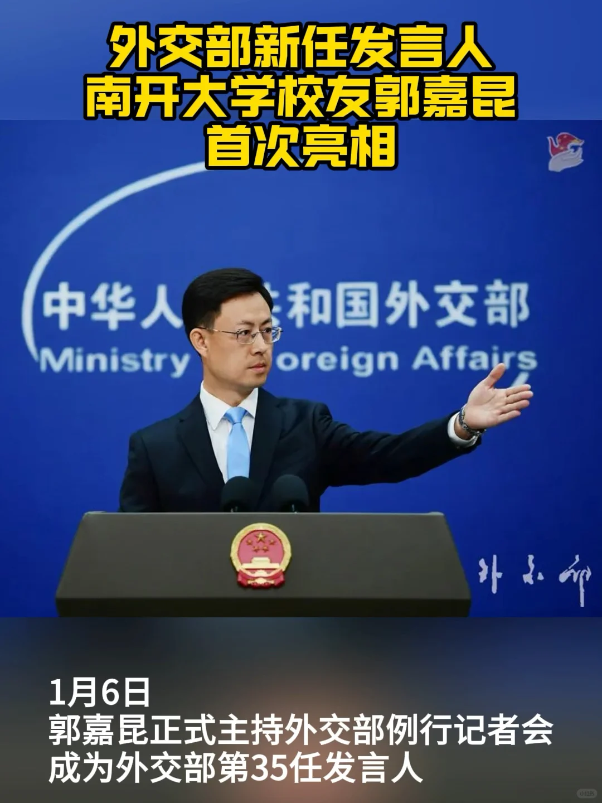

# 南开校友郭嘉昆成为外交部第35任发言人

## 基本信息

- 作者：南开大学
- 发布时间：2025-01-06 16:59:16
- 点赞数：1380
- 收藏数：87
- 评论数：40
- 分享数：159

## 正文

1月6日，外交部新任发言人郭嘉昆主持例行记者会。他是外交部第35任发言人，也是首位“80后”发言人。
郭嘉昆出生于1980年8月，蒙古族，毕业于南开大学，曾任中国常驻联合国代表团三秘、外交部非洲司四处副处长、外交部政策规划司处长等职。
在政策规划司工作期间，郭嘉昆多次在多边场合发出清晰的中国声音，向外界宣示中国外交政策。
祝贺！！
	
#南开大学[话题]# #巍巍南开[话题]# #南开校友[话题]#

## 图片

## 评论

### 网汇优选 (1970-01-01 08:00:00)

哪个学院毕业的呀？

### 天津收音机迷 (1970-01-01 08:00:00)

简历速奉上啊！[doge]

### momo (1970-01-01 08:00:00)

是不是未来的外交部长[doge]

### 18斤 (1970-01-01 08:00:00)

你这视频颜色不好，人民网的好，看起来超帅

### 八宝饭 (1970-01-01 08:00:00)

一脸正气

### April- (1970-01-01 08:00:00)

@guyuverse   好棒好棒！

### Mei (1970-01-01 08:00:00)

外交部选的都是一面正气，文质彬彬的[点赞R][点赞R]

### 爱闻草香 (1970-01-01 08:00:00)

人才辈出！

### 老公目前在旷野 (1970-01-01 08:00:00)

@浓盐系

### HR卷卷子 (1970-01-01 08:00:00)

国家鲲

