# 南开大二宿舍日常｜一学期十六门课 谁敢挑战

## 基本信息

- 作者：笨鸟不会飞
- 发布时间：2025-02-18 17:28:03
- 点赞数：1408
- 收藏数：78
- 评论数：23
- 分享数：10

## 正文

把课表整理出来了
4门逻辑学专业必修课（全班只有3个人 明天就要上了 谁来蹲3个人怎么上课）
3门金融课（辅修）
2门哲学的专业选修课，一个法国哲学一个魏晋玄学（因为在哲学院所以要上学院的专选课
4门通识必修课，语文英语体育什么懂的（甚至在思考要不要这学期把军理上了 加上军理就是5门
3门通识选修课，其中2门选的医学院的（活的太不健康了想了解一下医学常识），1门全英的（激励自己学点英语吧）！
学的好杂 但好符合我高中时期对大学的印象
还有四份工要打 谁知道我会忙成什么样😭
-
新整了一套故宫主题的的开学文具套装！
天呐现在的文具套装做的好好看啊好高级啊！
这个还是晨光和故宫的联名-金榜题名套装！
里面有金卡、御守、祈愿卡纸啥的，寓意学业顺顺利利~
就很适合送今年有重要考试的朋友~
而且京东🔍~晨光大牌日~满79还能立➖20
2月17日-2月19日每天16点和20点还能蹲点抢1r文具哦！
学生党还没选好开学文具的可以去康康啦~
#晨光文具[话题]# #晨光开学季[话题]# #晨光金榜题名套装[话题]# #晨光京东大牌日[话题]# #宿舍生活[话题]# #大学生[话题]# #学习[话题]# #studywithme[话题]# #宿舍[话题]# #大学宿舍[话题]#

## 图片

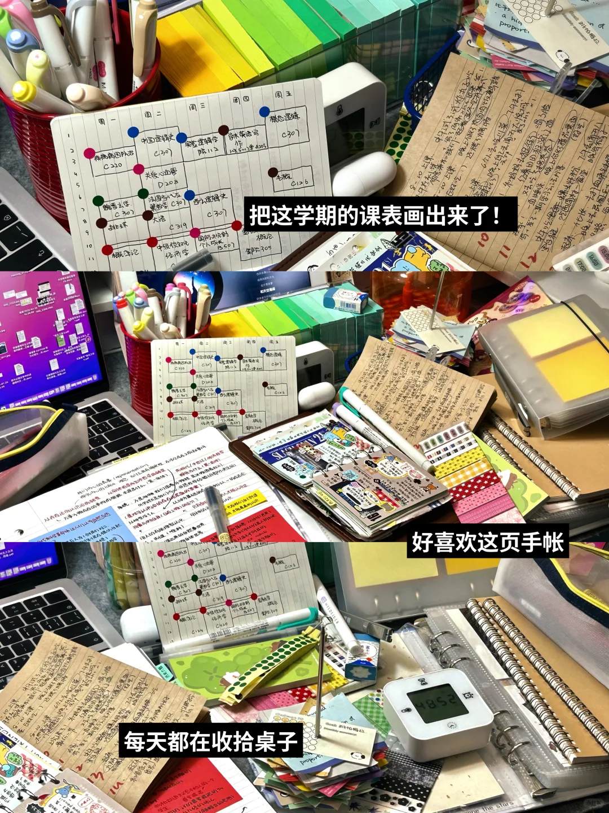

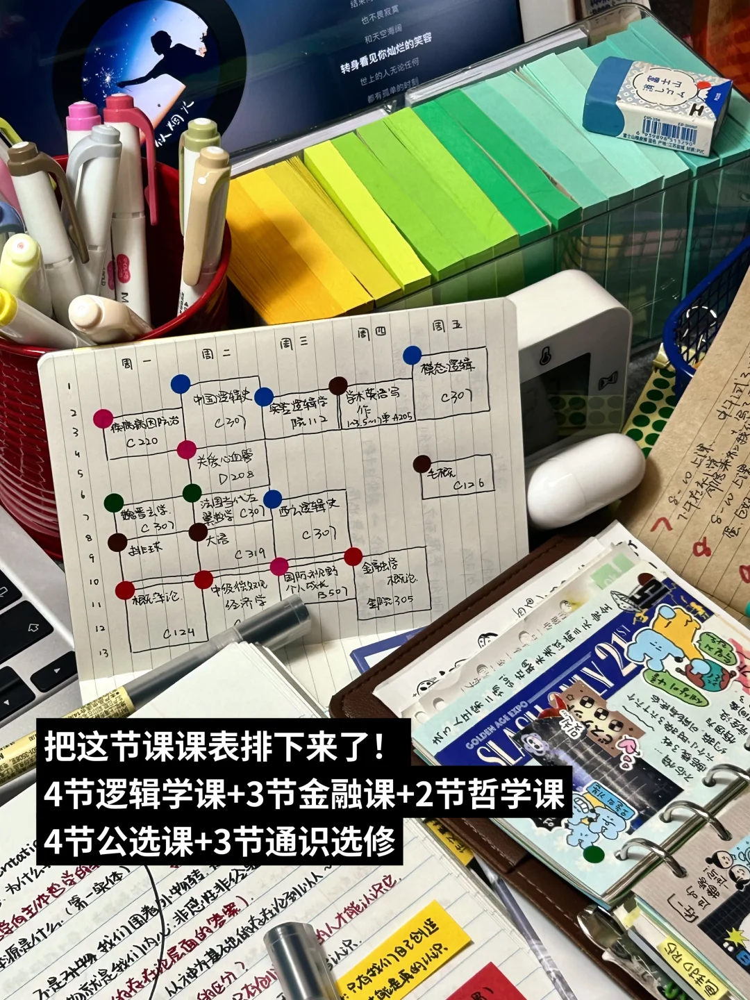

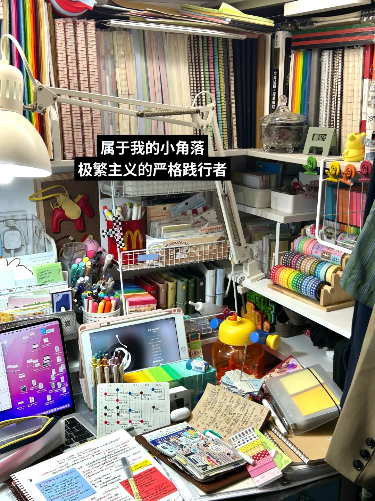

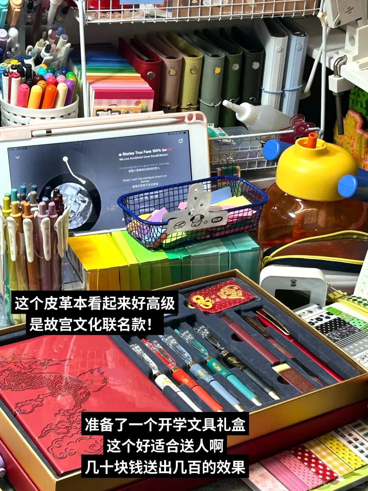

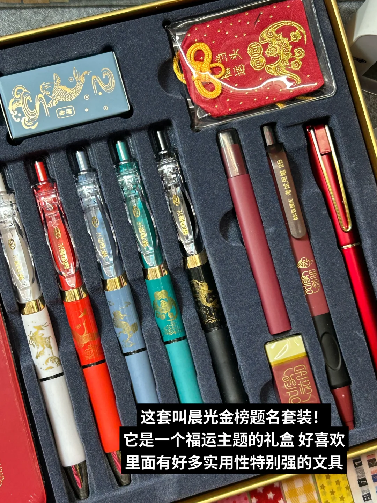

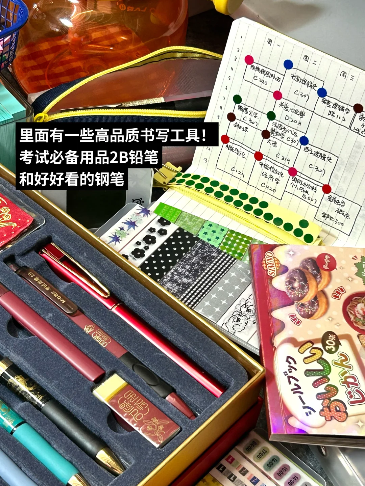

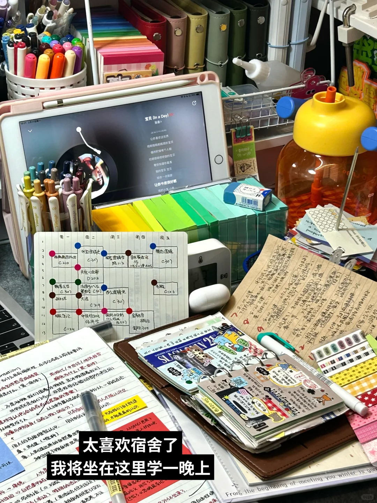

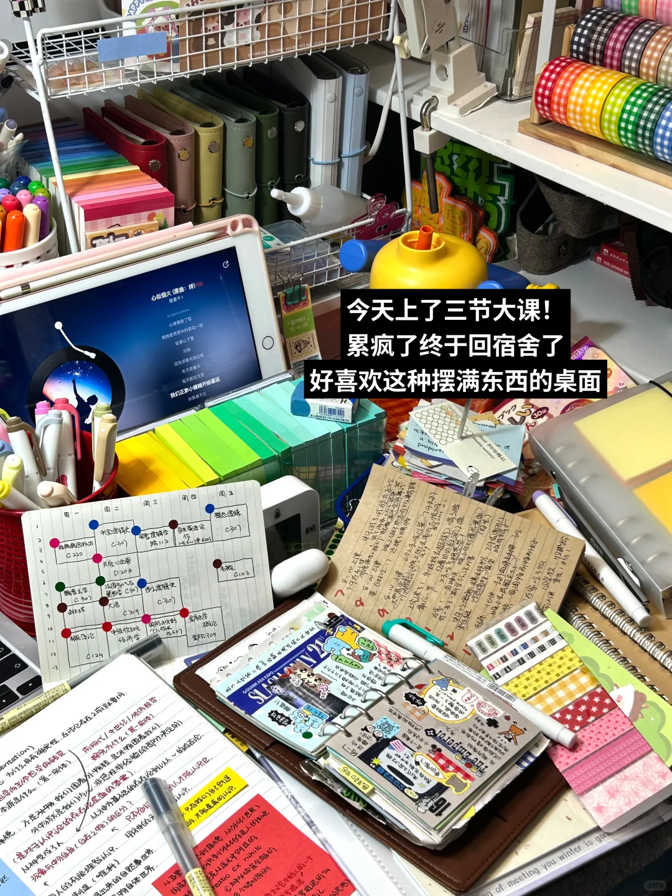

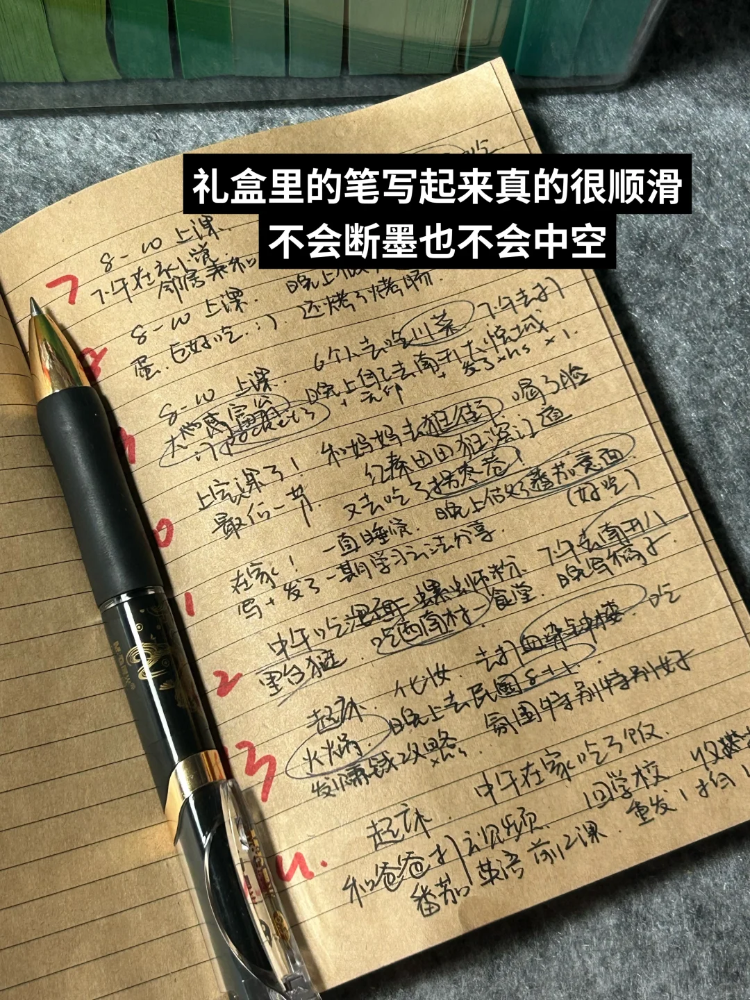

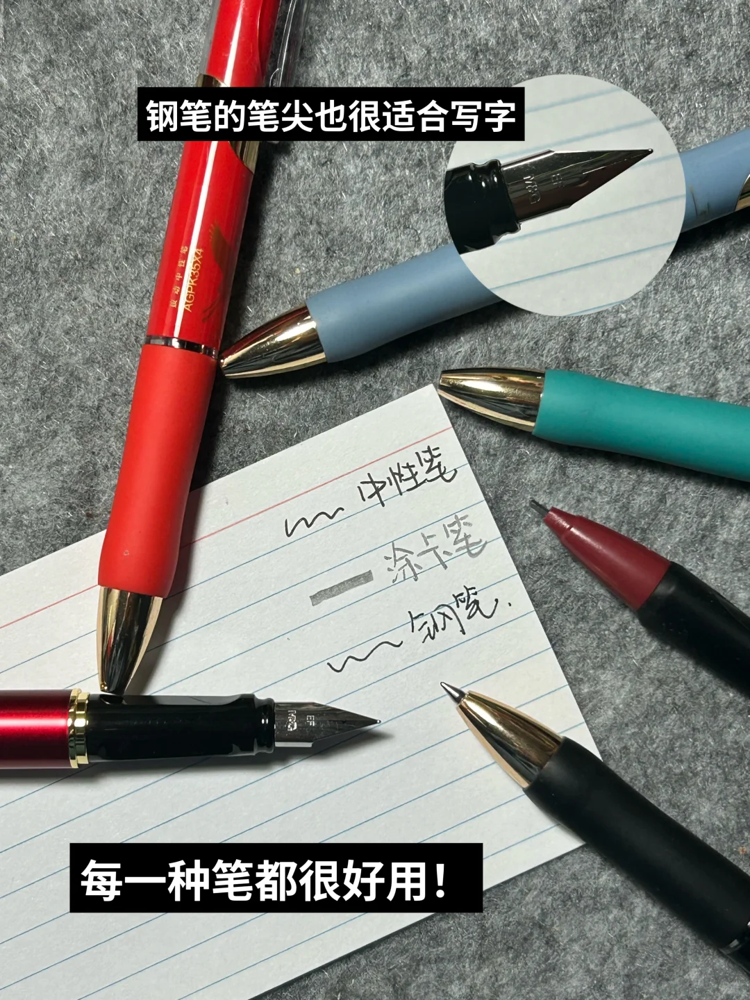

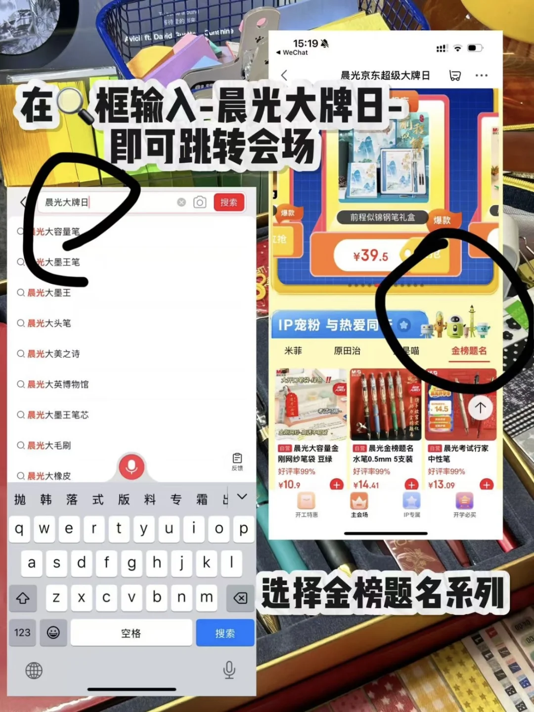

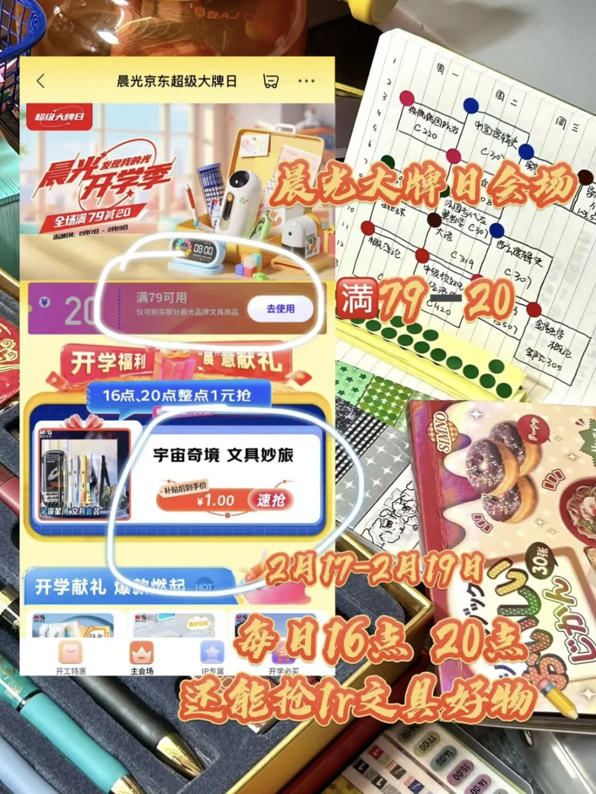

## 评论

### 永远不想长大 (1970-01-01 08:00:00)

我在学校很痛苦怎么办，感觉每天浑浑噩噩的[哭惹R][哭惹R][哭惹R]

### . (1970-01-01 08:00:00)

南开有逻辑学吗，在哪个大类呀

### IVY舒心 (1970-01-01 08:00:00)

课表这么满还打四份工 HOLD住！！！！ 但很佩服宝贝[飞吻R]

### In der nacht于夜色中 (1970-01-01 08:00:00)

15门课没打工[哭惹R]还是不太努力

### 鱼籽酱 (1970-01-01 08:00:00)

@今天rain了吗 @南方只下雨 @Evan 其实我很喜欢这种[捂脸R]

### 阿jio 不摆烂 (1970-01-01 08:00:00)

我滴妈 简直我的理想小桌

### 四喜（上岸版） (1970-01-01 08:00:00)

好好看[偷笑R]

### 十九 (1970-01-01 08:00:00)

借楼[害羞R]蹲蹲四六级和 大英赛  搭子，打卡背单词，有个伴，互相监督[害羞R][害羞R]最好大一或大二的同龄人

### 冰栗糕 (1970-01-01 08:00:00)

宝宝手帐本是哪家的呀？

### 星星在发光 (1970-01-01 08:00:00)

好喜欢你的图片[派对R]

