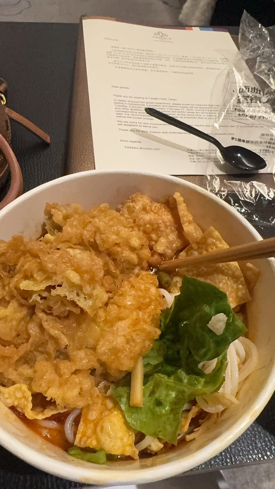
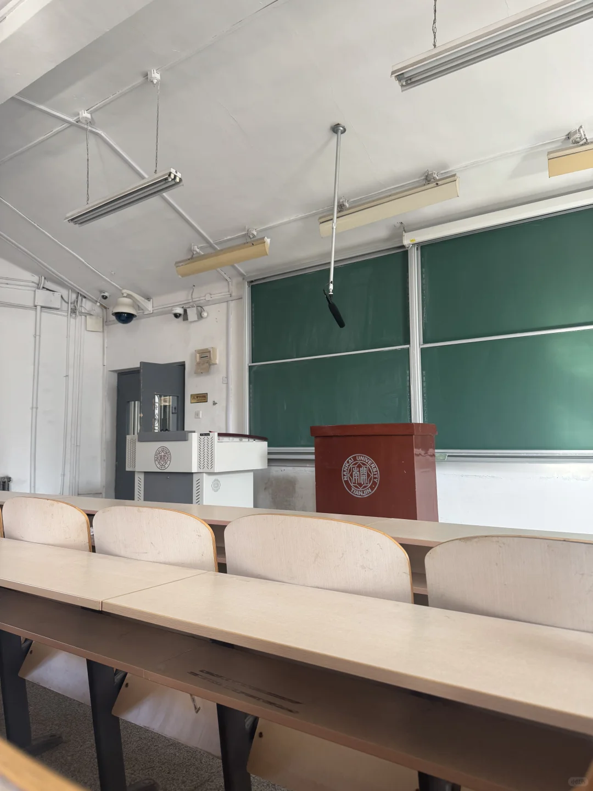
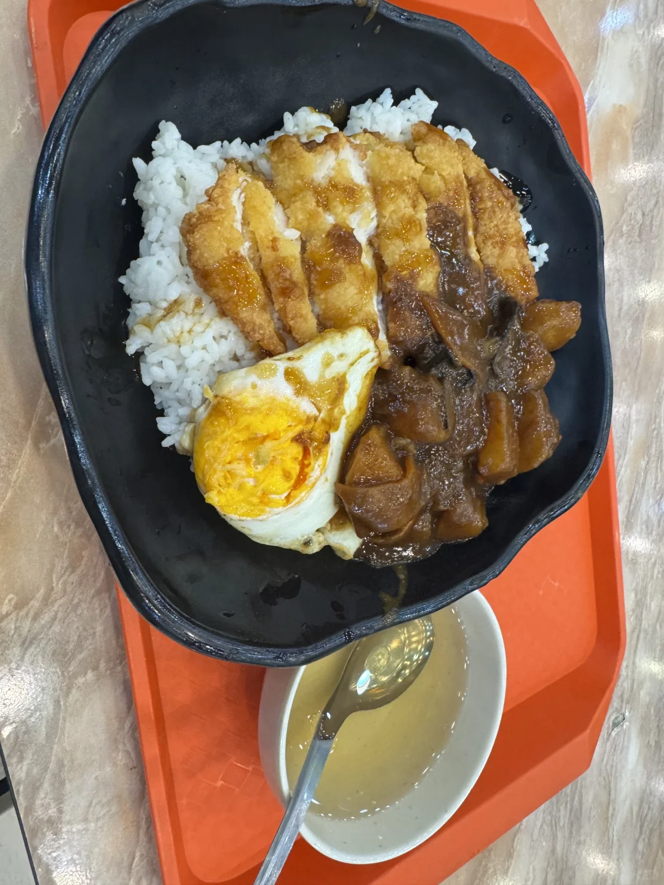
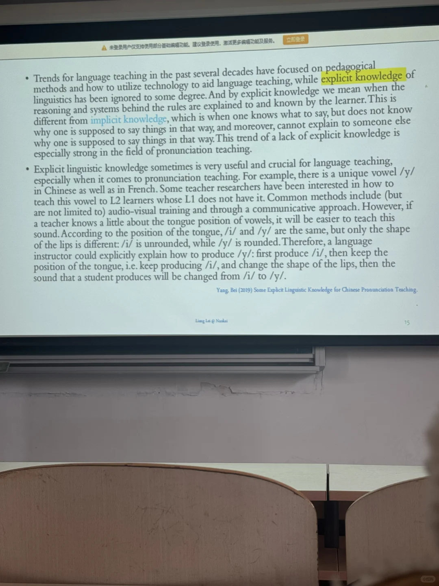
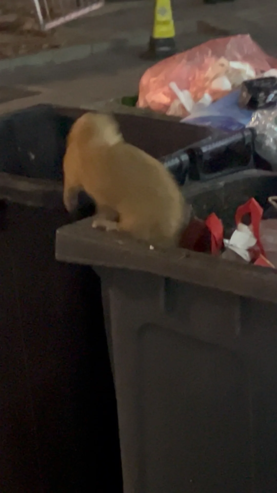
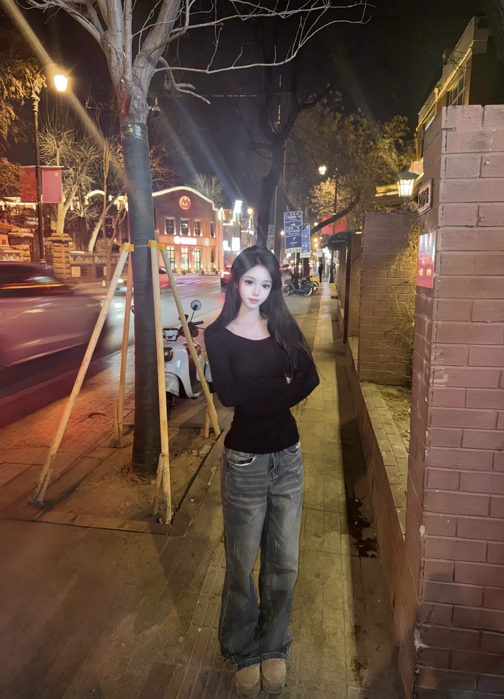

# 南开大一｜刚开学的日常

## 基本信息

- 作者：第三只猫
- 发布时间：2025-02-27 15:10:16
- 点赞数：1251
- 收藏数：114
- 评论数：107
- 分享数：57
- 发布地点：天津

## 正文

开学一周，状态已经慢慢变好了，除了上课也会去天津四处转转，打打游戏或者解锁新的美食。
现在化妆和拍照也在尝试不同风格，就连p图技术都上升了一个level哈哈。
P9是宿舍楼下垃圾桶里拍到的，不知道是学长还是学姐，室友说像黄鼠狼，我觉得好像雪貂。#当我开始享受我的大学生活[话题]# #大学生的日常[话题]#

## 图片

